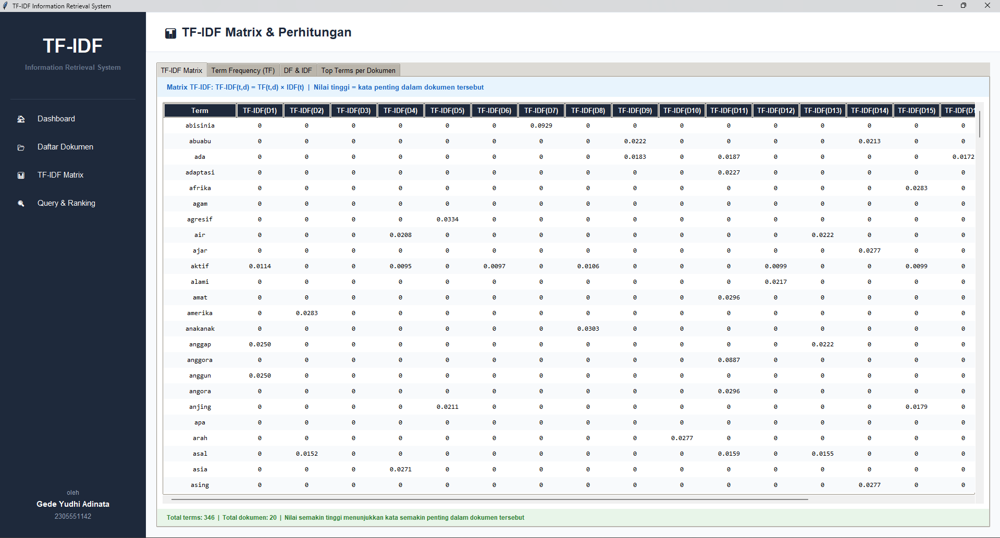

# Cat Breed Information Retrieval System (TF-IDF) 🐱

An Advanced Information Retrieval system using the **TF-IDF (Term Frequency - Inverse Document Frequency)** method to rank documents based on query relevance.

## App Preview

## Core Features
- **Modern Preprocessing**: Case folding, punctuation removal, Stopword removal, and Stemming using the Sastrawi library.
- **Natural Sorting**: Intelligently sorted document list (D1, D2, ..., D10, D20).
- **Multi-Tab Visualization**:
  - **TF-IDF Matrix**: Displays the final weight of each term for every document.
  - **Term Frequency**: Tables showing raw counts and normalized TF values.
  - **DF & IDF**: Measures term uniqueness and importance across the corpus.
  - **Top Terms**: A card-based summary of the most important words per document.
- **Advanced Query Search**: A powerful search bar that provides relevance scores and detailed mathematical calculations.

## Dataset (Corpus)
Utilizes a comprehensive dataset of **20 Documents (D1-D20)** covering detailed information about various cat breeds such as Persian, Maine Coon, Bengal, Ragdoll, and many others.

## Tech Stack
- **Language**: Python 3.x
- **GUI**: Tkinter & TTK (Custom Sleek Design)
- **Mathematical Tool**: Numpy
- **NLP Library**: Sastrawi (Indonesian Language Stemmer)
